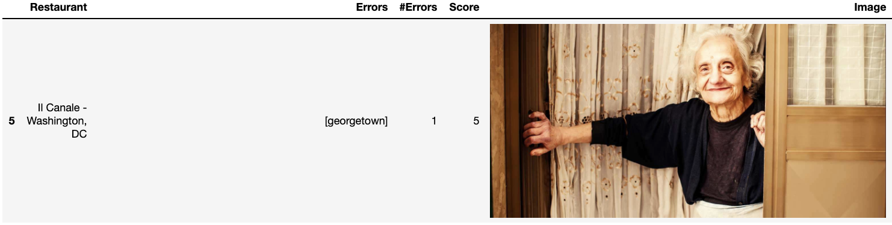

# FIRe: Fake Italian Restaurants evaluator
FIRe helps non-Italian speakers evaluate the authenticity of Italian restaurants based in the U.S. with a unique Italian *culinary* corpus

---
## Setup & Usage
- Clone this repo on your local machine using `https://github.com/matteobucalossi50/FIRe-Fake-Italian-Restaurants-evaluator`
- Set your directory in terminal
```shell
$ cd ./FIRe-Fake-Italian-Restaurants-evaluator
```
- You will then use [`fire.py`](https://github.com/matteobucalossi50/FIRe-Fake-Italian-Restaurants-evaluator/blob/master/fire.py) to run FIRe
```shell
$ python fire.py
```
Please provide URLs exclusively from [opentable.com](opentable.com) when asked to

Feed FIRe different Italian restaurants and see for yourself how "Italian" they are!

---
## Example
You can also preview an example of FIRe at work on a test sample of few menus in the [`FIRe-example.ipynb`](https://github.com/matteobucalossi50/FIRe-Fake-Italian-Restaurants-evaluator/blob/master/FIRe-example.ipynb) notebook

Here's an instance of what one outcome looks like:


